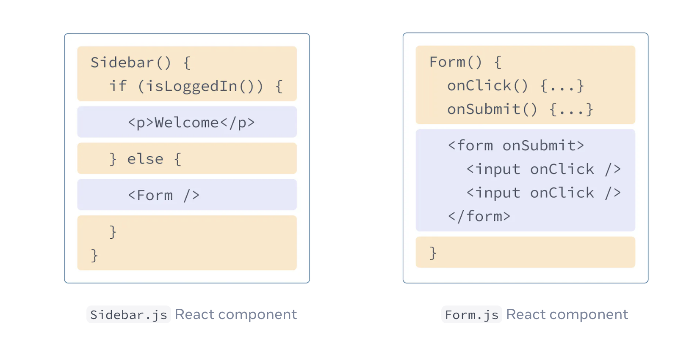
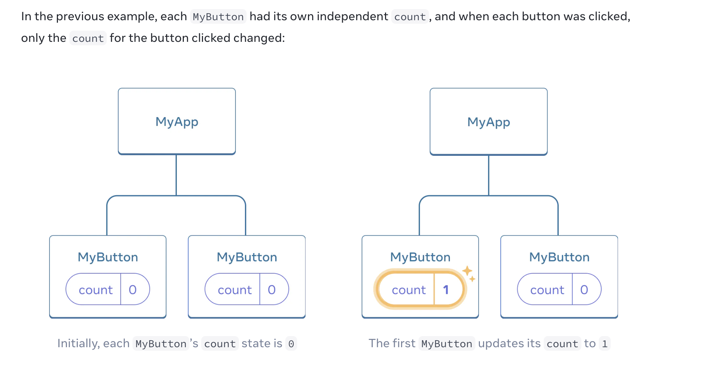
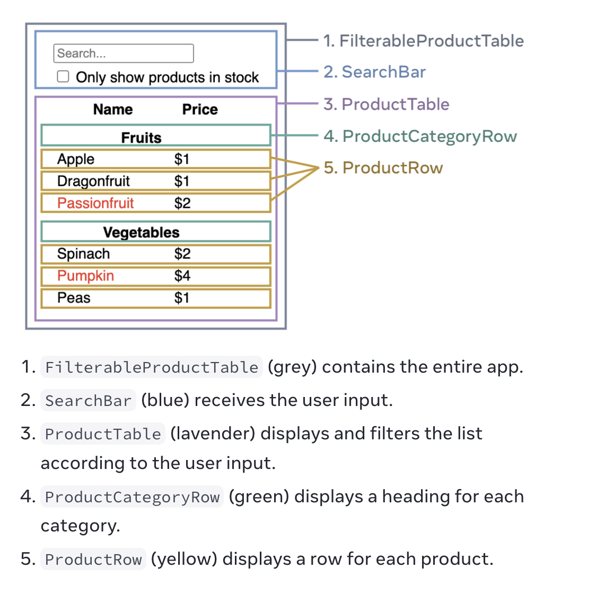

# React学习

This project was bootstrapped with [Create React App](https://github.com/facebook/create-react-app).
react demo，就是测试下react的各种功能，以及各种表单或者UI组件，想学习一个新东西的最好方法，就是动手去实践，”把手弄脏“

最近重新理解了学习之道，最快的学习方式，是我们去用这个技术，去做我们想做的事情，或者是说我们想做的事情，刚好能够用到这个技术

## 关于自己对React的理解
目前个人理解，不一定准确。前端的技术其实核心分为2类，一类是css等样式相关，这种不是react所关心的；一种是js。
页面如何渲染，正常是浏览器加载完成html内容后，css和js执行，其实整个行为很多时候不可预测，因为可能网络原因，js加载的前后顺序不一致，导致会出现问题，并且模块的复用，一直也没有一个规范。
react相对于js，有点像spring boot 对于java，提供了很多开箱即用的功能。
我很喜欢react的哲学，一切尽在js，连页面的渲染顺序，也都是由js所决定。

## 开发知识学习

### JSX
在react官网上的[介绍](https://react.dev/learn/writing-markup-with-jsx#jsx-putting-markup-into-javascript),并且其中提到的，为什么会有类似于react这些框架的出现，因为随着互联网的发展，页面的逻辑越来越重，很多页面都是不同的情况展示不同的内容，会开始由js来控制整个页面的内容。
```
But as the Web became more interactive, logic increasingly determined content. JavaScript was in charge of the HTML! This is why in React, rendering logic and markup live together in the same place—components.
```
旧的页面组织形态

新的页面的组织形态


而为什么会使用JSX，就是因为JSX比html，更容易表现组件化，可以很清晰地表示UI的组件结构

### 关于在两个组件间共享内容

两个组件间如何共享


## 关于React的设计思想
[设计思想参考](https://react.dev/learn/thinking-in-react)
### 基本步骤
1. Break the UI into a component hierarchy
    - 单一职责原则 
2. Build a static version in React
    - Building a static version requires a lot of typing and no thinking
3. Find the minimal but complete representation of UI state
    - Props are like arguments you pass to a function. They let a parent component pass data to a child component and customize its appearance. For example, a Form can pass a color prop to a Button.
    - State is like a component’s memory. It lets a component keep track of some information and change it in response to interactions. For example, a Button might keep track of isHovered state.
4. Identify where your state should live
    - Identify components that use state:
ProductTable needs to filter the product list based on that state (search text and checkbox value).
    - SearchBar needs to display that state (search text and checkbox value).
Find their common parent: The first parent component both components share is FilterableProductTable.
    - Decide where the state lives: We’ll keep the filter text and checked state values in FilterableProductTable.
5. Add inverse data flow

### 关于数据传递
1. React uses one-way data flow, passing data down the component hierarchy from parent to child component.

## 思考
1. 自己想去build一个完整项目的时候，才发现其实react还欠缺的一些东西，业务项目如何组织，路由等，所以发现其实很多人不仅仅用的是原生的react，会使用类似于next之类的方案
## Available Scripts

In the project directory, you can run:

### `npm start`

Runs the app in the development mode.\
Open [http://localhost:3000](http://localhost:3000) to view it in your browser.

The page will reload when you make changes.\
You may also see any lint errors in the console.

### `npm test`

Launches the test runner in the interactive watch mode.\
See the section about [running tests](https://facebook.github.io/create-react-app/docs/running-tests) for more information.

### `npm run build`

Builds the app for production to the `build` folder.\
It correctly bundles React in production mode and optimizes the build for the best performance.

The build is minified and the filenames include the hashes.\
Your app is ready to be deployed!

See the section about [deployment](https://facebook.github.io/create-react-app/docs/deployment) for more information.

### `npm run eject`

**Note: this is a one-way operation. Once you `eject`, you can't go back!**

If you aren't satisfied with the build tool and configuration choices, you can `eject` at any time. This command will remove the single build dependency from your project.

Instead, it will copy all the configuration files and the transitive dependencies (webpack, Babel, ESLint, etc) right into your project so you have full control over them. All of the commands except `eject` will still work, but they will point to the copied scripts so you can tweak them. At this point you're on your own.

You don't have to ever use `eject`. The curated feature set is suitable for small and middle deployments, and you shouldn't feel obligated to use this feature. However we understand that this tool wouldn't be useful if you couldn't customize it when you are ready for it.

## Learn More

You can learn more in the [Create React App documentation](https://facebook.github.io/create-react-app/docs/getting-started).

To learn React, check out the [React documentation](https://reactjs.org/).

### Code Splitting

This section has moved here: [https://facebook.github.io/create-react-app/docs/code-splitting](https://facebook.github.io/create-react-app/docs/code-splitting)

### Analyzing the Bundle Size

This section has moved here: [https://facebook.github.io/create-react-app/docs/analyzing-the-bundle-size](https://facebook.github.io/create-react-app/docs/analyzing-the-bundle-size)

### Making a Progressive Web App

This section has moved here: [https://facebook.github.io/create-react-app/docs/making-a-progressive-web-app](https://facebook.github.io/create-react-app/docs/making-a-progressive-web-app)

### Advanced Configuration

This section has moved here: [https://facebook.github.io/create-react-app/docs/advanced-configuration](https://facebook.github.io/create-react-app/docs/advanced-configuration)

### Deployment

This section has moved here: [https://facebook.github.io/create-react-app/docs/deployment](https://facebook.github.io/create-react-app/docs/deployment)

### `npm run build` fails to minify

This section has moved here: [https://facebook.github.io/create-react-app/docs/troubleshooting#npm-run-build-fails-to-minify](https://facebook.github.io/create-react-app/docs/troubleshooting#npm-run-build-fails-to-minify)


## 参考学习链接
1. [react官网学习资料](https://react.dev/learn)
